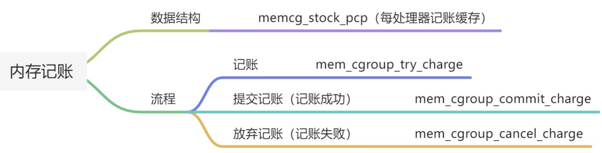

# [Memcg]()



## memcg_stock_pcp

```c
/* 每处理器记账缓存一次从内存控制组批量申请32页, 然后把内存控制组的内存使用量加上32页 */
#define CHARGE_BATCH	32U
/* 
 * 在内存控制组记账(charge)时, 先查看当前处理器的memcg_stock_pcp
 * 如果memcg_stock_pcp保存的内存控制组(memcg_stock_pcp->cached)正是准备记账的内存控制组
 * 并且预留页数(memcg_stock_pcp->nr_pages)大于或等于准备记账的页数, 则将预留页数减去准备记账的页数
 */
struct memcg_stock_pcp {
	struct mem_cgroup *cached; /* 内存控制组(非根控制组) this never be root cgroup */
	unsigned int nr_pages;     /* 预留页数 */
	struct work_struct work;   /* 工作任务 */
	unsigned long flags;
#define FLUSHING_CACHED_CHARGE	0
};
/* 为减少处理器之间的竞争, 提高内存记账效率, 定义一个每处理器记账缓存 */
static DEFINE_PER_CPU(struct memcg_stock_pcp, memcg_stock);
static DEFINE_MUTEX(percpu_charge_mutex);
```


## mem_cgroup_try_charge

```c
/* Whether the swap controller is active */
#ifdef CONFIG_MEMCG_SWAP
int do_swap_account __read_mostly; /* 启用交换分区记账 */
#else
#define do_swap_account		0
#endif

/* 尝试记账一个page
 * page: 准备记账的页
 * mm: 指向申请物理页的进程的内存描述符
 * gfp_mask: 申请分配物理页的分配掩码
 * memcgp: 输出参数, 返回记账的内存控制组
 * compound: 以复合页还是单页的方式记账
 */
int mem_cgroup_try_charge(struct page *page, struct mm_struct *mm,
			  gfp_t gfp_mask, struct mem_cgroup **memcgp,
			  bool compound)
{
	struct mem_cgroup *memcg = NULL;
	unsigned int nr_pages = compound ? hpage_nr_pages(page) : 1; /* 如果是复合页则需要计算页数, 否则就是单页 */ 
	int ret = 0;
    
	if (mem_cgroup_disabled()) /* 如果禁用内存控制组则返回0 */
		goto out;

	if (PageSwapCache(page)) {  /* page在swap cache中 */
		/*
		 * Every swap fault against a single page tries to charge the
		 * page, bail as early as possible.  shmem_unuse() encounters
		 * already charged pages, too.  The USED bit is protected by
		 * the page lock, which serializes swap cache removal, which
		 * in turn serializes uncharging.
		 */
		VM_BUG_ON_PAGE(!PageLocked(page), page);
		if (compound_head(page)->mem_cgroup)
			goto out;

		if (do_swap_account) {
			swp_entry_t ent = { .val = page_private(page), }; /* 从page->private成员得到交换项 */
			unsigned short id = lookup_swap_cgroup_id(ent);   /* 根据交换项得到内存控制组id */

			rcu_read_lock();
			memcg = mem_cgroup_from_id(id);					  /* 根据id查找memcg */
			if (memcg && !css_tryget_online(&memcg->css))     /* 如果该memcg存在, 则引用计算加1 */
				memcg = NULL;
			rcu_read_unlock();
		}
	}

	if (!memcg)
		memcg = get_mem_cgroup_from_mm(mm);      /* 如果内存控制组为空, 则根据内存描述符查找进程所属的内存控制组 */

	ret = try_charge(memcg, gfp_mask, nr_pages); /* 进入真正的尝试记账流程[见2.1节] */
 
	css_put(&memcg->css);      /* 内存控制组的引用计数减1 */
out:
	*memcgp = memcg;           /* 入参memcgp用于返回记账的内存控制组 */
	return ret;
}
```

### try_charge

```c
static int try_charge(struct mem_cgroup *memcg, gfp_t gfp_mask,
		      unsigned int nr_pages)
{
	unsigned int batch = max(CHARGE_BATCH, nr_pages); /* 取32和记账页数较大的那个值 */
	int nr_retries = MEM_CGROUP_RECLAIM_RETRIES;      /* 最多重试5次 */
	struct mem_cgroup *mem_over_limit;                /* 用于记录超过内存使用限制(硬限制)的控制组 */
    struct page_counter *counter;                     /* 记账的页面计数器 */
	unsigned long nr_reclaimed;                       /* 回收的页面数量 */
	bool may_swap = true;
	bool drained = false;

	if (mem_cgroup_is_root(memcg)) /* 进程属于根控制组: 因为根控制组对内存使用量没有限制, 所以不需要记账直接返回 */
		return 0;
retry:
    /* 
     * 如果当前cpu的记账缓存从准备记账的内存控制组预留的页数足够多,
     * 那么从记账缓存减去准备记账的页数(而无需向内存控制组记账), 并结束记账返回成功[见2.2节]
     */
	if (consume_stock(memcg, nr_pages))
		return 0;

    /* 
     *  1. 没有开启内存+交换分区记账, 直接进入mem_cgroup->memory记账流程[见2.3节]
     *  2. 开启内存+交换分区记账, 则首先进入memsw记账流程, 成功后再进入memory记账流程
     */
	if (!do_memsw_account() ||
	    page_counter_try_charge(&memcg->memsw, batch, &counter)) {
        /* 当前内存控制组和其所有启用分层记账的祖先的内存使用量没有超过限制, 则进入记账成功流程 */
		if (page_counter_try_charge(&memcg->memory, batch, &counter))
			goto done_restock;
        /* 
         * 如果mem_cgroup->memory超过限制记账失败,
         * 而且开启内存+交换分区记账, 则还需要撤销前面内存+交换分区的记账
         */
		if (do_memsw_account())
			page_counter_uncharge(&memcg->memsw, batch);
		mem_over_limit = mem_cgroup_from_counter(counter, memory);/* 记录内存使用量超过限制的内存控制组 */
	} else {
		mem_over_limit = mem_cgroup_from_counter(counter, memsw); /* 记录内存+交换分区使用量超过限制的内存控制组 */
		may_swap = false;
	}

	if (batch > nr_pages) {            /* 如果batch大于准备记账的实际页数, 则使用实际页数重试记账流程 */
		batch = nr_pages;
		goto retry;
	}

	/*
	 * Unlike in global OOM situations, memcg is not in a physical
	 * memory shortage.  Allow dying and OOM-killed tasks to
	 * bypass the last charges so that they can exit quickly and
	 * free their memory. 对于oom选中的进程允许charge超过硬限制（就算内存不够了）
	 */
	if (unlikely(tsk_is_oom_victim(current) ||
		     fatal_signal_pending(current) ||
		     current->flags & PF_EXITING))
		goto force;

	/*
	 * Prevent unbounded recursion when reclaim operations need to
	 * allocate memory. This might exceed the limits temporarily,
	 * but we prefer facilitating memory reclaim and getting back
	 * under the limit over triggering OOM kills in these cases.
	 * 对于这种紧急内存申请flag也允许charge超过硬限制
	 */
	if (unlikely(current->flags & PF_MEMALLOC))
		goto force;

	if (unlikely(task_in_memcg_oom(current)))       /* 当前memcg已经在oom过程中直接返回nomem */
		goto nomem;

	if (!gfpflags_allow_blocking(gfp_mask))         /* 内存分配不允许block则直接返回nomem */
		goto nomem;

	mem_cgroup_event(mem_over_limit, MEMCG_MAX);    /* 记录MEMCG_MAX事件到mem_cgroup_stat_cpu */

    /*
     * mem_over_limit记录了超过限制的内存控制组
     * 这里尝试针对该控制组进行内存回收, 并返回回收的页面数量
     */
	nr_reclaimed = try_to_free_mem_cgroup_pages(mem_over_limit, nr_pages,
						    gfp_mask, may_swap);

    /* 内存回收之后, 剩余的内存使用量已经足够记账申请的页数, 则进入重试流程[见2.4节] */
	if (mem_cgroup_margin(mem_over_limit) >= nr_pages)
		goto retry;

    /* drained默认为false, 代表是否有把每处理器记账缓存预留的页数归还给内存控制组，走到这里说明内存不够了 */
	if (!drained) {
        /* 把每处理器记账缓存预留的页数归还给内存控制组, 并进入重试流程[见2.5节] */
		drain_all_stock(mem_over_limit);
		drained = true;
		goto retry;
	}

	if (gfp_mask & __GFP_NORETRY) /* 如果申请页面时不允许重试, 则进入nomem流程 */
		goto nomem;
	/*
	 * Even though the limit is exceeded at this point, reclaim
	 * may have been able to free some pages.  Retry the charge
	 * before killing the task.
	 *
	 * Only for regular pages, though: huge pages are rather
	 * unlikely to succeed so close to the limit, and we fall back
	 * to regular pages anyway in case of failure.
	 */
    /* 如果从超过限制的内存控制组回收的页数大于0, 并且准备记账的页数没有超过8, 则进入重试流程 */
	if (nr_reclaimed && nr_pages <= (1 << PAGE_ALLOC_COSTLY_ORDER))
		goto retry;
	/*
	 * At task move, charge accounts can be doubly counted. So, it's
	 * better to wait until the end of task_move if something is going on.
	 */
	if (mem_cgroup_wait_acct_move(mem_over_limit))
		goto retry;

	if (nr_retries--)             /* 最多重试5次 */
		goto retry;

	if (gfp_mask & __GFP_NOFAIL)  /* 如果申请页面时不允许失败, 则强制记账允许内存使用超过限制 */
		goto force;

	if (fatal_signal_pending(current))
		goto force;

	mem_cgroup_event(mem_over_limit, MEMCG_OOM); /* 记录MEMCG_OOM事件到mem_cgroup_stat_cpu */

	mem_cgroup_oom(mem_over_limit, gfp_mask,     /* 把进程设置为内存控制组内存耗尽状态 */
		       get_order(nr_pages * PAGE_SIZE));
nomem:
	if (!(gfp_mask & __GFP_NOFAIL))  /* 如果申请页面时允许失败, 则返回错误码ENOMEM */
		return -ENOMEM;
force:
	/*
	 * The allocation either can't fail or will lead to more memory
	 * being freed very soon.  Allow memory usage go over the limit
	 * temporarily by force charging it.
	 */
    /* 如果申请页面时不允许失败, 则强制记账, 允许内存使用量临时超过硬限制 */
	page_counter_charge(&memcg->memory, nr_pages);
	if (do_memsw_account())
		page_counter_charge(&memcg->memsw, nr_pages);
	css_get_many(&memcg->css, nr_pages);  /* 内存控制组的引用计数加上记账的页数 */

	return 0;

done_restock:
	css_get_many(&memcg->css, batch);     /* 内存控制组引用计数加上记账的页数 */
	if (batch > nr_pages)                 /*  把记账多余的页数保留到当前cpu的记账缓存[见2.6节] */ 
		refill_stock(memcg, batch - nr_pages);

	/*
	 * If the hierarchy is above the normal consumption range, schedule
	 * reclaim on returning to userland.  We can perform reclaim here
	 * if __GFP_RECLAIM but let's always punt for simplicity and so that
	 * GFP_KERNEL can consistently be used during reclaim.  @memcg is
	 * not recorded as it most likely matches current's and won't
	 * change in the meantime.  As high limit is checked again before
	 * reclaim, the cost of mismatch is negligible.
	 */
	do {
		if (page_counter_read(&memcg->memory) > memcg->high) {
			/* Don't bother a random interrupted task */
			if (in_interrupt()) {
				schedule_work(&memcg->high_work);
				break;
			}
			current->memcg_nr_pages_over_high += batch;
			set_notify_resume(current);
			break;
		}
	} while ((memcg = parent_mem_cgroup(memcg)));

	return 0;
}
```

